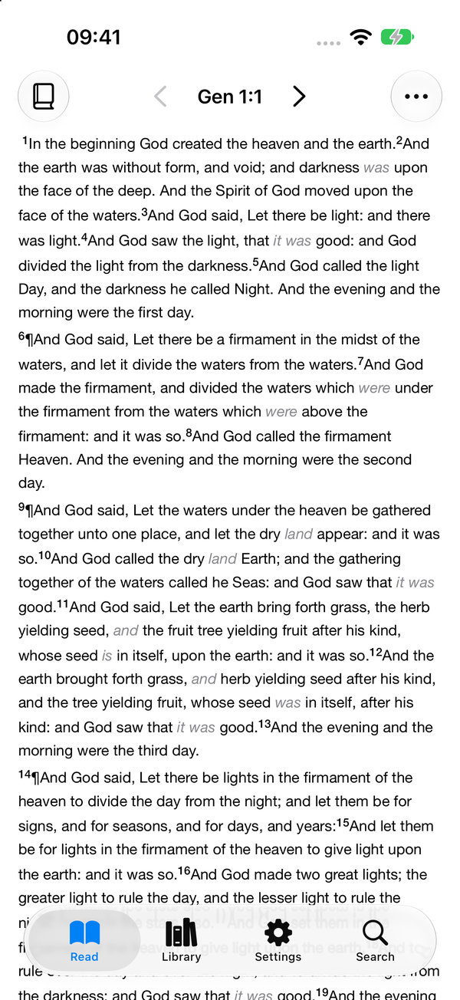
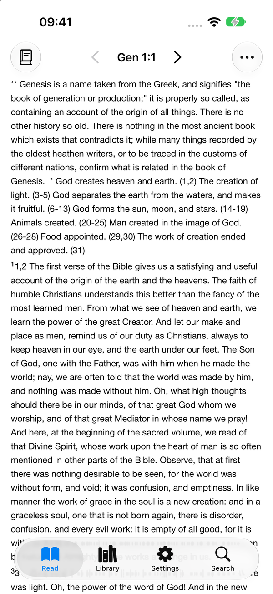
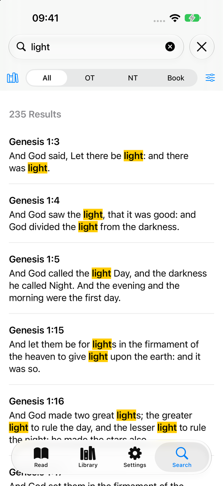
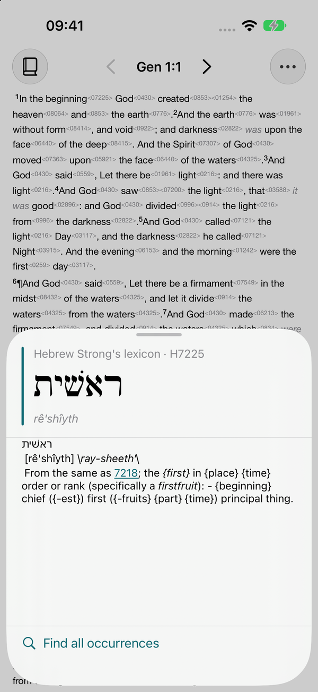
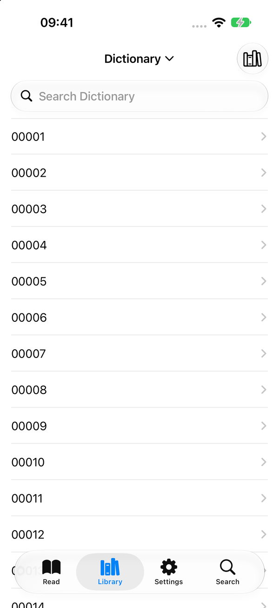
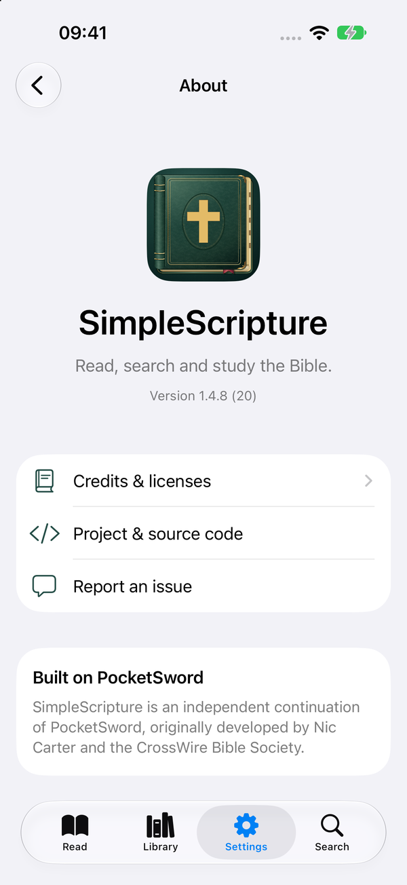

## SimpleScripture

SimpleScripture is a lightweight offline Bible reader for iOS with KJV and
MHCC built in, plus Greek and Hebrew word-study tools. iOS 27+ required.

### Screenshots

Light mode on an iPhone 18 Pro simulator.

| Bible reading | Commentary | Search |
| :---: | :---: | :---: |
|  |  |  |

| Word study | Library | About |
| :---: | :---: | :---: |
|  |  |  |

SimpleScripture is a fork of PocketSword, which was originally developed by Nic Carter and the CrossWire Bible Society.

PocketSword was one of my favourite Bible apps growing up, however it stopped getting updated and thus slowly disappeared off my devices. Given the app is open-source I forked it and re-wrote the app in Swift/SwiftUI and updated it for newer iPhones.

The application is distributed under GNU GPLv2.

Bundled study texts and fonts retain their separate notices - you can see these in the "about" section of the app.
