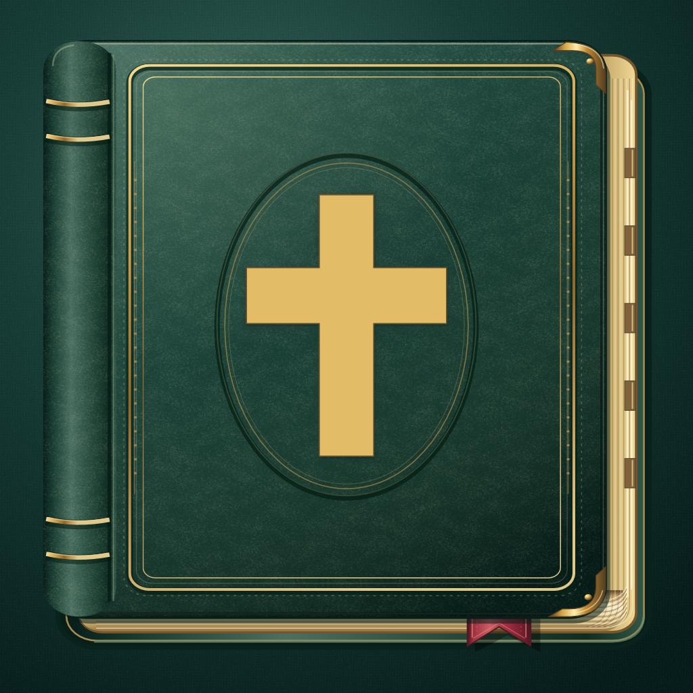

# SimpleScripture

An offline Bible reader for iPhone and iPad, with the King James Version,
Matthew Henry's Concise Commentary, and Greek and Hebrew word-study tools.
Requires iOS or iPadOS 27.

- [Using SimpleScripture](docs/user-guide.md)
- [Build, test and architecture notes](CLAUDE.md)
- [Report an issue or suggest a feature](https://github.com/timTam97/pocketsword/issues)
- [Branding and progress](docs/rebranding/README.md)
- [Licences and attribution](docs/licensing/about-notices.md)

Open `PocketSword.xcodeproj` in Xcode 27 and build the `PocketSword` scheme.
The product is `SimpleScripture.app`; there are no package-manager steps.

An independent continuation of [PocketSword](https://bitbucket.org/niccarter/pocketsword),
originally developed by Nic Carter and the CrossWire Bible Society.
The application is distributed under [GNU GPLv2](Resources/doc/LICENSE.txt);
bundled study texts and fonts retain their [separate notices](Resources/Notices).
App Store publication is still in preparation; see the
[release assessment](docs/licensing/README.md).
